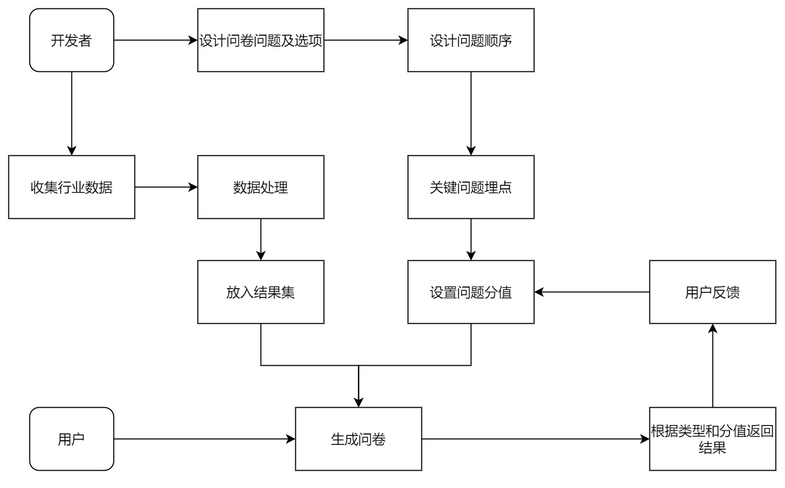
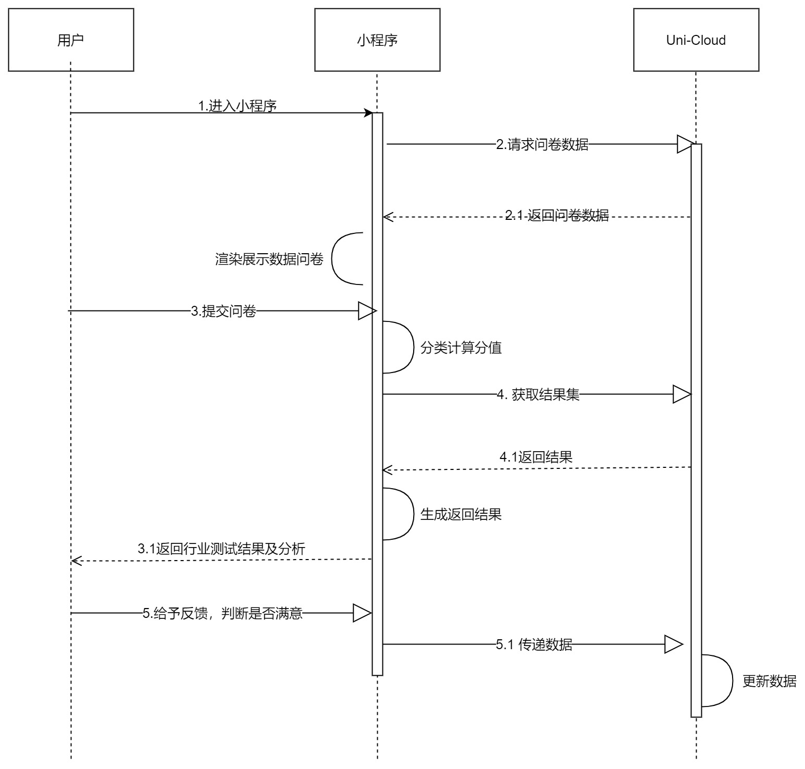

##  0 基本信息

> 仓库地址:  
>
> https://gitee.com/Serio/analysis-of-employment-based-on-collaborative-filtering
>
> https://github.com/CoderSerio/analysis-of-employment-based-on-collaborative-filtering
>
>
> 设计稿：
> (无，参考4.2.2 组件设计)

开发请切一个新的分支！不要直接操作master！

## 1 文档改动记录
## 2 需求

### 2.1 需求背景概述 

开放性实验室重点项目，需要在九月内完成。预期是让用户通过做调查问卷的形式，再配合已经收集分析好的数据样本进行行业身份预测给出一或多个符合的职业及相关分析。核心算法负责人因为特殊原因无法继续参与项目，后端也因为特殊原因无法继续参与项目，项目改为完全由前端决定导向。
本来我都想因为特殊原因无法继续参与了

### 2.2 需求目标

完成一个能实现完整功能的小程序，并至少得到软著。

## 3 完整链路

### 3.1 流程图

### 3.2 时序图

## 4 技术方案

### 4.1 理论依据
#### 4.1.1 概述
> **霍兰德职业兴趣测评**
> https://cs.090h.com/XlExam/detail/id/231.html?sid=Mjc3XzE2MzE1OTA3NDc=&bd_vid=7414178159327025014
> 根据选项预测性格，再结合其他关键信息比如年龄和性别等，然后反馈职业结果
> 具体一点，比如年龄大于35，我们可以直接排除程序员这一个职业**(未采用)**

> 由于核心算法的缺失，此处可以不必关注数据的准确性，而改为关注用户的满意程度——将收集好的数据返回概率初始化为均等，用户得到结果后选择是否满意，满意则加强关键选项和返回结果之间的联系，否则为减弱 

#### 4.1.2 具体分类

> R 现实型
> E 企业型
> S 社会型
> I 科研型
> C 综合型
> A 艺术型

### 4.2 前端技术

开发新功能注意自己开一个分支写，别直接用master写，也不要在master下使用merge操作，改用rebase

#### 4.2.1 概览

> **开发工具**
>
> HBuilderX + 微信小程序IDE
>
> **核心技术**
>
> uni-app + Vue3 + TS + uni-cloud Serveless
>
> **组件库**
>
> First-UI
> https://doc.firstui.cn/
>
> **配色参考**
>
> 没有UI，自立更生吧，暂定采用【釉蓝】为主题色**（未采用）**
> http://zhongguose.com/

第三方依赖安装形式是Uni插件，放在了uni_modules目录下而非node_modules目录下
这种依赖已经一同上传至git仓库，无需手动安装

#### 4.2.2 组件设计

> 核心理念：高耦合，低内聚，可复用，易维护（标准话术懂的都懂，只能说尽量吧）

**问卷**

1. 新建立一个页面questionnaire
2. 样式采用First-UI
3. 考虑处于最后一题时按钮变化为提交且居中，另外注意点击上一题时要保留用户的选项
     （其实就是一个数组的事...）
4. 每个题目具有id、类型、分值等关键字段，需要动态记录题目的id和选项，以便于最后的分析

**推荐职业**

- 程序员
阿巴阿巴吧把
- 教师
唔西迪西，玛卡巴卡

**用户反馈组件**

- 符合期望
- 不符合期望(选择此项，则展示下面几个子选项)（多选，为什么不符合）
  - 缺少科技感（则阈值的I加一分，下文同理）
  - 缺少实践性
  - 缺少艺术感
  - 缺少人文性
  - 缺少企业感
  - 专业性过强

### 4.3 数据

#### 4.3.1 数据结构

**问卷数据结构**
选项由【非常符合】【有点符合】【有点不符合】【非常不符合】构成, type需要参考4.1理论依据

> "questionnaire": {
>     "question": [
>         {
>             "id": 1,
>             "title": "你是否喜欢计算机",
>             "type": ["R", "S"],  // 一些问题可能涉及到多个分类,
>             "answer": "" // 枚举值1234分别对应上述选项
>         }
>     ]
> }

**结果**
填完表单之后，获取到的结果

> “res”: {
>     "occupations": [
>       {
>         "name": "程序员",
>         "info": "擅长CRUD阿巴阿巴”
>       },
>     ]
> }

**用户反馈问卷**

> "commends": {
>     "isSatisfied": false,
>     "reason": [
>           {
>             info: “缺乏现实性”
>             type: "R"
>           },
>           {
>             info: “社会性不足”
>             type: "S" 
>           },
>           {
>             info: “没有科技感”
>             type: "E" 
>           },
>           // 其他几项略
>       ]  // 这是一个多选选项，如果 isStatisfied 为 true，那么这里置空
> }

#### 4.3.2 更新方式

如果用户反馈满意，那么给当前所有职业的一个随机属性加上一点

如果用户反馈不满意，那么再让其选择原因，根据其原因选择对应的一项扣除一点

> 这里存在恶意刷分的问题
>
> 计划改成N次请求都没有被放过的职业的阈值分数将向初始值收敛
> （目前并未实现，暂时没有时间作）

## 5 排期

先这么排，具体时间由需求负责人自行决定，有delay的情况请提前反馈，暴露风险
公司里每天还开晨会说排期的事情，但是我们就不用搞那么频繁吧...看情况来...
### 5.1 日程表
（略，其实一共就用了四天左右）

### 5.2 延期记录

| 需求点       | 原因               |
| ------------ | ------------------ |
| 数据结构设计 | 开发VSCode插件去了 |
|              |                    |
|              |                    |

